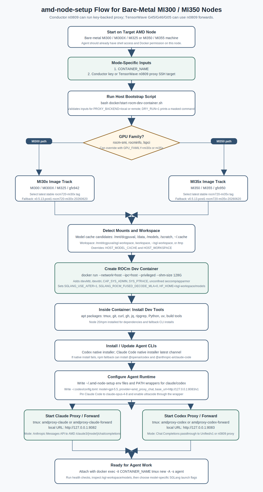

# amd-node-setup

Public repo for setting up AMD ROCm dev/model-serving nodes for agent work.

The intended workflow is deliberately small. A human gives a Cursor agent exactly two operational inputs:

1. Docker container name
2. Application API key from the LLM API Gateway

The agent then detects the node, creates the ROCm dev container, installs the agent CLIs, configures the AMD gateway proxies, and leaves the container ready for Claude Code, Codex, and SGLang model-serving tests.

No real API keys, tokens, node-private mount paths, reverse SSH tunnel details, or account-specific gateway internals belong in this public repo.

## Bare-Metal Node Flow

This flow assumes the agent is already logged into the target bare-metal AMD node, usually an MI300/MI300X/MI325 or MI350/MI355 machine. Docker should already be installed and usable by the agent on the host. The repo does not provision the node itself and does not create a reverse tunnel.



## Step Review

| Step | What the agent does | Decision conditions | Installs or writes | Expected result |
| --- | --- | --- | --- | --- |
| 1. Start on node | Work directly on the target bare-metal MI node. | The node should already have shell access, Docker installed, and Docker permission. | Nothing yet. | Agent is operating on the same node that will host the ROCm dev container. |
| 2. Collect two inputs | Require `CONTAINER_NAME` and `LLM_GATEWAY_API_KEY`. | If either value is missing, `docker/start-rocm-dev-container.sh` exits before Docker work. | Nothing committed; key is passed through env. | Human only needs to provide container name and LLM Gateway application key. |
| 3. Detect GPU family | Read `rocm-smi`, `rocminfo`, and `lspci` output when available. | MI300/MI300X/MI325/gfx942 -> `mi30x`; MI350/MI355/gfx950 -> `mi35x`; unknown -> warn and default to `mi35x`; override with `GPU_FAMILY`. | Nothing installed. | Correct ROCm/SGLang Docker image family is selected. |
| 4. Select image | Query Docker Hub for the newest stable `v*.rocm720-{family}-YYYYMMDD` tag. | If Docker Hub query fails or no matching tag is found, use the 2026-06-20 fallback image for the detected family. | Nothing installed. | Container uses latest stable `rocm720` image for MI30x or MI35x. |
| 5. Detect mounts | Search common model-cache and workspace locations. | Model cache candidates include `/mnt/dcgpuval/huggingface`, `/data/huggingface`, `/data/models`, `/models`, `/mnt/models`, `/scratch/huggingface`, `~/.cache/huggingface`; override with `HOST_MODEL_CACHE`. Workspace prefers `/mnt/dcgpuval/sgl-workspace`, `/workspace`, `~/sgl-workspace`, then `/tmp/sgl-workspace`; override with `HOST_WORKSPACE`. | Creates the workspace directory unless `DRY_RUN=1`. | `/sgl-workspace/models` and `/sgl-workspace/workspace` are mounted when available. |
| 6. Create container | Run Docker with host networking and ROCm device access. | Always uses `--network=host`, `--ipc=host`, `--privileged`, `--shm-size 128G`, `/dev/kfd`, `/dev/dri`, `CAP_SYS_ADMIN`, `SYS_PTRACE`, unconfined seccomp/apparmor. | Sets `SGLANG_USE_AITER=1`, `SGLANG_ROCM_FUSED_DECODE_MLA=0`, `HF_HOME=/sgl-workspace/models`, repo mount at `/opt/amd-node-setup`. | Detached ROCm dev container starts and keeps running. |
| 7. Install base tools | Run `scripts/setup-dev-env.sh` inside the container. | Debian/Ubuntu-style container expected. Node defaults to 20 LTS; `INSTALL_*` flags can skip selected tools. | Installs apt packages: `tmux`, `git`, `curl`, `wget`, `jq`, `ripgrep`, `rsync`, `openssh-client`, `vim`, `htop`, `python3`, `pip`, `venv`, `python3-requests`, build tools, Node/npm, `uv`, and `gh`. | Container has shell/dev tooling and GitHub CLI; `gh auth login` remains manual. |
| 8. Install agent CLIs | Prefer native installers for Codex and Claude Code. | Codex native install runs with `CODEX_NON_INTERACTIVE=1`; Claude native install uses `CLAUDE_NATIVE_CHANNEL=latest`; if native install fails and fallback is enabled, npm installs are used. | Native path installs `codex` and `claude` into `~/.local/bin`; npm fallback installs `@openai/codex@latest` and `@anthropic-ai/claude-code@latest`. | `codex --version` and `claude --version` should work. Rerunning the setup updates both CLIs. |
| 9. Configure runtime | Run `scripts/setup-agent-runtime.sh` inside the container. | Requires the LLM Gateway key from step 2. If an existing non-generated `~/.codex/config.toml` exists, it is backed up first. | Writes `~/.amd-node-setup/*`, PATH wrappers for `claude` and `codex`, and `~/.codex/config.toml`. | Claude defaults to Opus 4.8 ultracode/xhigh; Codex defaults to GPT 5.5 ultrahigh represented as `xhigh`. |
| 10. Start proxies | Start two tmux sessions. | Always local to the container/node; no reverse SSH tunnel. `LLM_GATEWAY_OPENAI_BASE_URL` can override the Codex upstream if AMD's OpenAI-compatible gateway base differs. | Starts `amdproxy-claude` on `127.0.0.1:8082` and `amdproxy-codex` on `127.0.0.1:8083`. | Claude Code and Codex can route through local AMD gateway proxies. |
| 11. Ready state | Attach and verify before model serving tests. | Do not launch model-specific SGLang commands until the agent inspects the node and target model path. | No more default installs. | Run health checks, inspect `/sgl-workspace/models`, then choose test-specific SGLang launch flags. |

## What This Sets Up

- A ROCm/SGLang dev container selected for MI30x or MI35x class GPUs.
- Docker runtime flags that match the current AMD node workflow, including `--privileged` and `--shm-size 128G`.
- Tooling inside the container: `tmux`, `gh`, Node/npm, Claude Code, Codex CLI, `uv`, Python helpers, and common shell tools.
- Two container-local `tmux` proxy sessions:
  - `amdproxy-claude` on `127.0.0.1:8082` for Claude Code.
  - `amdproxy-codex` on `127.0.0.1:8083` for Codex/OpenAI-compatible traffic.
- Default agent model settings:
  - Claude Code: Opus 4.8 through the AMD gateway, with ultracode enabled by the generated wrapper and `xhigh` sent as the model effort.
  - Codex: GPT 5.5 with Codex `model_reasoning_effort = "xhigh"`, used here as the current Codex config equivalent of the requested ultrahigh setting.

This repo does not create a reverse SSH tunnel and does not launch a model-specific SGLang server by default. The agent should inspect `/sgl-workspace/models` and choose model-specific SGLang flags only after the container exists.

## Layout

```text
scripts/
  setup-dev-env.sh             # installs tmux, gh, Node/npm, uv, Codex, Claude Code
  setup-agent-runtime.sh       # writes env/config files and starts both proxy tmux sessions
docker/
  start-rocm-dev-container.sh  # creates the ROCm dev container
proxy/
  amd_proxy.py                 # Claude translator mode and OpenAI-compatible passthrough mode
systemd/
  amdproxy.service             # optional non-container service template
docs/
  cursor-agent-workflow.md
  review-questions.md
```

## Current CLI Installation

Checked on 2026-06-21:

- OpenAI Codex CLI docs recommend the standalone installer on macOS/Linux:
  `curl -fsSL https://chatgpt.com/codex/install.sh | sh`
- OpenAI docs say standalone Codex CLI installs are upgraded by rerunning that installer.
- Claude Code docs recommend native install:
  `curl -fsSL https://claude.ai/install.sh | bash`
- Claude Code native installs auto-update in the background, and `claude update` applies an immediate manual update.
- `@openai/codex@latest` npm metadata reports Node `>=16`.
- `@anthropic-ai/claude-code@latest` npm metadata reports Node `>=18.0.0`.
- This repo still installs Node 20 LTS by default because npm is useful on dev nodes and remains the fallback path for both CLIs.

References:

- OpenAI Codex CLI setup: <https://developers.openai.com/codex/cli>
- OpenAI Codex config basics: <https://developers.openai.com/codex/config-basic>
- OpenAI Codex advanced config: <https://developers.openai.com/codex/config-advanced>
- Anthropic Claude Code setup: <https://code.claude.com/docs/en/setup>
- Anthropic Claude Code model config: <https://code.claude.com/docs/en/model-config>

The bootstrap installs/updates Claude Code and Codex with native installers by default:

```bash
curl -fsSL https://chatgpt.com/codex/install.sh | CODEX_NON_INTERACTIVE=1 sh
curl -fsSL https://claude.ai/install.sh | bash -s latest
```

If the native installer fails in a container, the script falls back to npm unless disabled:

```bash
CODEX_NPM_FALLBACK=0 CLAUDE_NPM_FALLBACK=0 bash scripts/setup-dev-env.sh
```

The npm path can also be selected explicitly:

```bash
CODEX_INSTALL_METHOD=npm CLAUDE_INSTALL_METHOD=npm bash scripts/setup-dev-env.sh
```

GitHub CLI is installed, but authentication is intentionally manual:

```bash
gh auth login
gh auth status
```

## Create a ROCm Dev Container

From this repo on the host, provide the two required inputs:

```bash
CONTAINER_NAME=my-amd-test \
LLM_GATEWAY_API_KEY=REPLACE_WITH_APPLICATION_KEY \
bash docker/start-rocm-dev-container.sh
```

Preview detection and the generated Docker command without creating the container:

```bash
DRY_RUN=1 \
CONTAINER_NAME=my-amd-test \
LLM_GATEWAY_API_KEY=REPLACE_WITH_APPLICATION_KEY \
bash docker/start-rocm-dev-container.sh
```

The dry-run output masks the key.

To keep the key out of shell history:

```bash
read -rsp "LLM Gateway application key: " LLM_GATEWAY_API_KEY
echo
export LLM_GATEWAY_API_KEY
CONTAINER_NAME=my-amd-test bash docker/start-rocm-dev-container.sh
```

The script will:

- detect GPU family from `rocm-smi`, `rocminfo`, or `lspci`
- use `mi35x` for MI350/MI355/gfx950-class nodes
- use `mi30x` for MI300/MI300X/MI325/gfx942-class nodes
- query Docker Hub for the latest stable tag matching `v*.rocm720-{family}-YYYYMMDD`
- fall back to the 2026-06-20 images if Docker Hub is unavailable
- detect likely model mounts such as `/mnt/dcgpuval/huggingface`, `/data/huggingface`, `/data/models`, `/models`, and `~/.cache/huggingface`
- detect/create a workspace mount
- run `scripts/setup-dev-env.sh` inside the container
- run `scripts/setup-agent-runtime.sh` inside the container
- start `amdproxy-claude` and `amdproxy-codex` in `tmux`

Fallback image examples:

```bash
rocm/sgl-dev:v0.5.13.post1-rocm720-mi35x-20260620
rocm/sgl-dev:v0.5.13.post1-rocm720-mi30x-20260620
```

The container always starts with:

```bash
--network=host
--ipc=host
--privileged
--shm-size 128G
--cap-add=CAP_SYS_ADMIN
--cap-add=SYS_PTRACE
--device=/dev/kfd
--device=/dev/dri
--group-add video
--security-opt seccomp=unconfined
--security-opt apparmor=unconfined
```

It also sets:

```bash
SGLANG_USE_AITER=1
SGLANG_ROCM_FUSED_DECODE_MLA=0
HF_HOME=/sgl-workspace/models
```

`SGLANG_USE_AITER=1` is intentional and visible in the script output. Override it only when the test specifically needs to avoid AITER:

```bash
SGLANG_USE_AITER=0 \
CONTAINER_NAME=my-no-aiter-test \
LLM_GATEWAY_API_KEY=REPLACE_WITH_APPLICATION_KEY \
bash docker/start-rocm-dev-container.sh
```

Attach to the container:

```bash
docker exec -it my-amd-test tmux new -A -s agent
```

## Runtime Files Inside the Container

`scripts/setup-agent-runtime.sh` writes container-local files under `~/.amd-node-setup/`:

```text
amdproxy-claude.env    # Claude proxy settings for port 8082
amdproxy-codex.env     # Codex/OpenAI-compatible proxy settings for port 8083
claude-env.sh          # Claude Code env
codex-env.sh           # Codex env
env.sh                 # PATH and shared shell env
bin/claude             # wrapper around the installed Claude Code binary
bin/codex              # wrapper around the installed Codex binary
```

It also writes `~/.codex/config.toml` with:

```toml
model = "gpt-5.5"
model_reasoning_effort = "xhigh"
openai_base_url = "http://127.0.0.1:8083/v1"
```

If `~/.codex/config.toml` already exists and was not generated by this repo, it is backed up first.

## Proxy Sessions

Claude Code proxy:

```bash
tmux attach -t amdproxy-claude
curl http://127.0.0.1:8082/health
curl http://127.0.0.1:8082/v1/models
```

The generated `claude` wrapper sources `~/.amd-node-setup/claude-env.sh` and runs Claude Code with ultracode enabled:

```bash
claude
```

Codex proxy:

```bash
tmux attach -t amdproxy-codex
curl http://127.0.0.1:8083/health
curl http://127.0.0.1:8083/v1/models
```

The generated `codex` wrapper sources `~/.amd-node-setup/codex-env.sh`:

```bash
codex
```

The Codex proxy defaults to forwarding OpenAI-compatible requests to:

```text
https://llm-api.amd.com/v1
```

If the LLM API Gateway exposes GPT/Codex-compatible models at a different base URL on a specific node/account, pass it while creating the container:

```bash
LLM_GATEWAY_OPENAI_BASE_URL=https://llm-api.amd.com/REPLACE_WITH_OPENAI_COMPATIBLE_BASE \
CONTAINER_NAME=my-amd-test \
LLM_GATEWAY_API_KEY=REPLACE_WITH_APPLICATION_KEY \
bash docker/start-rocm-dev-container.sh
```

## Override Detection

The agent can override detection explicitly when needed:

```bash
CONTAINER_NAME=my-test \
LLM_GATEWAY_API_KEY=REPLACE_WITH_APPLICATION_KEY \
GPU_FAMILY=mi30x \
IMAGE=rocm/sgl-dev:v0.5.13.post1-rocm720-mi30x-20260620 \
HOST_MODEL_CACHE=/mnt/dcgpuval/huggingface \
HOST_WORKSPACE=/mnt/dcgpuval/sgl-workspace \
bash docker/start-rocm-dev-container.sh
```

## Agent Prompt Pattern

Example instruction to Cursor:

```text
Use the amd-node-setup repo to create a ROCm dev container named qwen-test.
The LLM Gateway application API key is: <paste key>.
Detect whether this node is MI30x or MI35x, choose the latest stable rocm720 rocm/sgl-dev image,
mount the local model cache and workspace, install tmux/gh/Claude Code/Codex inside the container,
configure Claude Code through port 8082 and Codex through port 8083, start both AMD proxy tmux sessions,
then attach a tmux session.
Do not commit secrets.
```
